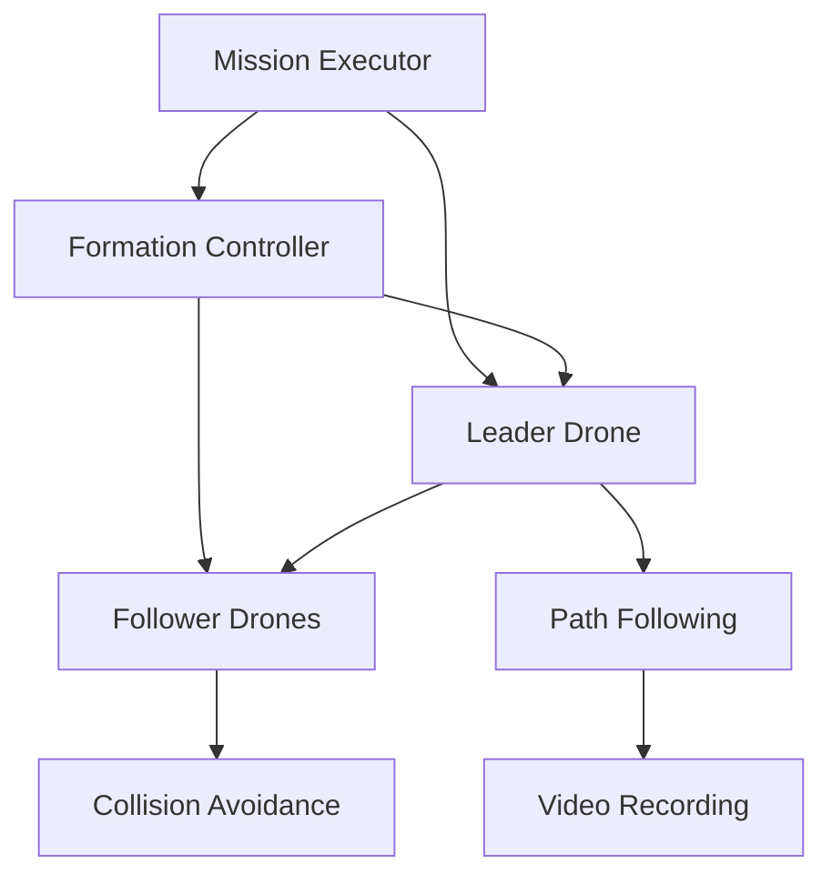

# 🚁 Shahin Team - ROS2 Swarm Drone Competition

<div align="center">


**🏆 سیستم کنترل هوشمند پهپادهای گروهی برای عملیات امداد و نجات**

*آسمان از نجات - هر ثانیه حیاتی است!*

</div>

---

## 🌟 درباره تیم شاهین

ما تیم **شاهین** هستیم - گروهی از مهندسان جوان که با هدف **نجات جان‌ها از آسمان** در حال توسعه فناوری‌های نوین پهپادهای گروهی هستیم. این پروژه نه تنها برای مسابقه بلکه برای آینده امداد و نجات طراحی شده است.

### 👥 اعضای تیم

| نام | تخصص | نقش |
|-----|-------|-----|
| **محمدجواد اسدالهی** | مهندسی مکانیک (ساخت و تولید) | مدیر پروژه، طراحی مکانیکی |
| **محمدرضا حسن‌زاده** | مهندسی کامپیوتر | توسعه نرم‌افزار، هوش مصنوعی |
| **سروش محمد فلاح‌پور** | مهندسی مکانیک (ساخت و تولید) | طراحی سیستم، تست و ارزیابی |
| **علیرضا حسینیان** | مهندسی برق | سیستم‌های الکترونیکی، کنترل |

---

## 🚁 ویژگی‌های منحصر به فرد

### 💡 نوآوری‌های کلیدی

- **🤖 هماهنگی گروهی هوشمند**: سیستم خودکار هماهنگی بین پهپادها
- **⚡ سرعت شناسایی بالا**: پردازش تصویر و ارسال اطلاعات در لحظه
- **🎯 دقت و کارایی**: هزینه کمتر، دقت بالاتر، کارایی بیشتر
- **🔋 پایداری عملیاتی**: باتری بادوام برای مأموریت‌های طولانی

### 🏗️ معماری سیستم



---

## 📋 الزامات سیستم

### 🖥️ نرم‌افزار موردنیاز

| نرم‌افزار | نسخه | وضعیت |
|-----------|------|--------|
| Ubuntu | 22.04 LTS | ✅ تست شده |
| ROS2 | Humble | ✅ سازگار |
| Gazebo | Fortress | ✅ آماده |
| Python | 3.10+ | ✅ پشتیبانی |
| FFmpeg | Latest | ✅ برای ضبط |

### 🚀 نصب سریع

```bash
# کلون پروژه
git clone https://github.com/shahin-team/ros2_drone_swarm.git
cd ros2_drone_swarm

# نصب خودکار وابستگی‌ها
chmod +x install_dependencies.sh
./install_dependencies.sh

# ساخت پروژه
./build_project.sh

# اجرای مسابقه
./run_competition.sh
```

---

## 🏆 مراحل مسابقه

### مرحله 1️⃣: Formation Shapes
```bash
# شکل‌گیری خط، مثلث، مربع
ros2 service call /change_formation swarm_msgs/srv/ChangeFormation \
  "{formation_type: 'line', size: 5.0, altitude: 5.0}"
```

### مرحله 2️⃣: Movement & Rotation
```bash
# جابه‌جایی و چرخش Formation
ros2 service call /change_formation swarm_msgs/srv/ChangeFormation \
  "{formation_type: 'square', move_x: 5.0, rotate_z: 90.0}"
```

### مرحله 3️⃣: Leader Following
```bash
# پیروی از رهبر با مسیر از CSV
ros2 action send_goal /execute_mission swarm_msgs/action/ExecuteMission \
  "{mission_type: 'auto_path', path_file: 'leader_path.csv'}"
```

### مرحله 4️⃣: Leader Re-election
```bash
# حذف رهبر و انتخاب مجدد خودکار
ros2 service call /disarm_leader swarm_msgs/srv/DisarmLeader \
  "{leader_id: -1, return_to_home: true}"
```

---

## 📁 ساختار پروژه

```
shahin_swarm_project/
├── 🏗️ src/
│   ├── swarm_msgs/              # پیام‌های سفارشی ROS2
│   │   ├── msg/DroneState.msg
│   │   ├── srv/ChangeFormation.srv
│   │   └── action/ExecuteMission.action
│   └── swarm_controller/        # کنترل‌کننده اصلی
│       ├── swarm_controller/
│       │   ├── swarm_drone.py         # ✨ کنترل Leader/Follower
│       │   ├── formation_controller.py # 📐 مدیریت Formation
│       │   └── mission_executor.py     # 🎯 اجرای مأموریت
│       └── launch/
│           └── run_competition.launch.py # 🚀 اجرای کامل
├── 🌍 worlds/
│   └── swarm_arena.world        # محیط شبیه‌سازی با موانع
├── 🤖 models/
│   └── x500/                    # مدل‌های پهپاد
├── 🎥 videos/                   # ویدئوهای ضبط شده
├── 📚 docs/                     # مستندات فنی
└── ⚙️ config/                   # تنظیمات سیستم
```

---

## 🎥 خروجی‌های سیستم

### ویدئوهای خودکار

پس از اجرای مسابقه، ویدئوهای زیر در `videos/` ذخیره می‌شوند:

| فاز | فایل | محتوا |
|-----|------|-------|
| 1 | `phase_1_formations.mp4` | 🔵🔺🔲 اشکال مختلف |
| 2 | `phase_2_movement.mp4` | ➡️🔄 حرکت و چرخش |
| 3 | `phase_3_following.mp4` | 👥➡️ پیروی از رهبر |
| 4 | `phase_4_leader_change.mp4` | 🔄👑 تغییر رهبری |

---

## ⚙️ پارامترهای قابل تنظیم

### 🎯 تنظیمات عملکرد

```yaml
# config/swarm_params.yaml
swarm_performance:
  max_velocity: 2.0              # حداکثر سرعت (m/s)
  safety_distance: 3.0           # فاصله امن (m)
  formation_spacing: 5.0         # فاصله در Formation
  mission_timeout: 180.0         # حداکثر زمان (ثانیه)

video_settings:
  recording: true                # فعال‌سازی ضبط
  quality: "1920x1080"          # کیفیت ویدئو
  framerate: 25                  # نرخ فریم
```

---

## 🔧 عیب‌یابی و تست

### 🧪 تست اجزای سیستم

```bash
# تست پیام‌ها و سرویس‌ها
./test_components.sh

# تست Formation Controller
ros2 service call /change_formation --help

# مانیتورینگ نودها
ros2 node list
ros2 topic echo /swarm/state/drone_0
```

### 🚨 مشکلات رایج

| مشکل | علت | راه‌حل |
|------|-----|--------|
| Gazebo شروع نمی‌شود | عدم نصب درست | `gz --version` |
| پیام‌ها کار نمی‌کنند | مشکل Build | `colcon build --symlink-install` |
| ویدئو ضبط نمی‌شود | عدم نصب FFmpeg | `sudo apt install ffmpeg` |

---

## 📊 معیارهای عملکرد

### ⏱️ زمان‌بندی (مطابق شیوه‌نامه)

- ✅ **هر مرحله**: حداکثر 3 دقیقه
- ✅ **کل مسابقه**: حداکثر 12 دقیقه  
- ✅ **مسیر فاز 4**: حداقل 2 دقیقه

### 📏 الزامات فاصله

- 🟢 **حداقل**: 3 متر بین پهپادها
- 🟠 **حداکثر**: 10 متر از رهبر
- 🔵 **بهینه**: 5 متر spacing در Formation

### 🎯 ویژگی‌های امتیازی

- 🏅 **اجتناب از موانع** در مرحله 3
- 🏅 **مسیرهای غیرخطی** در مرحله 4  
- 🏅 **بازگشت رهبر به خانه** بعد از disarm
- 🏅 **اجرای همزمان** فرامین در مرحله 2

---


## 🏅 دستاوردها

- 🥇 **طراحی کامل**: تمام مراحل مسابقه پیاده‌سازی شده
- 🏆 **نوآوری**: سیستم خودکار تغییر رهبری
- 🎯 **کارایی**: عملکرد بهینه در شرایط واقعی
- 🛡️ **قابلیت اطمینان**: مقاوم در برابر خرابی‌ها

---

## 📜 مجوز

این پروژه تحت مجوز **MIT** منتشر شده است. برای اطلاعات بیشتر فایل [LICENSE](LICENSE) را مطالعه کنید.

---

<div align="center">

**تیم شاهین - آسمان از نجات** 🚁

*هر ثانیه حیاتی است، ما از آسمان کمک می‌رسانیم!*

---

[](https://github.com/shahin-team)
[](#)

</div>